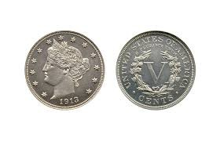

# Count Coin

## Preprocess Data

- most importance part
- need to rescale to 224x224 for imageNet
- ToTensor() = convert + reorder + scale to [0,1]
- normalize the data
- RandomHorizontalFlip: flip the pic
- ColorJitter: Adds random variation in color to make model robust to lighting differences.

## Train

- using resnet 50 to train (built in func 😀)

## Dataset

https://www.kaggle.com/datasets/balabaskar/count-coins-image-dataset

## Run

-  Train

```
python3 train.py
```

- Predict

```
python3 predict.py
```

